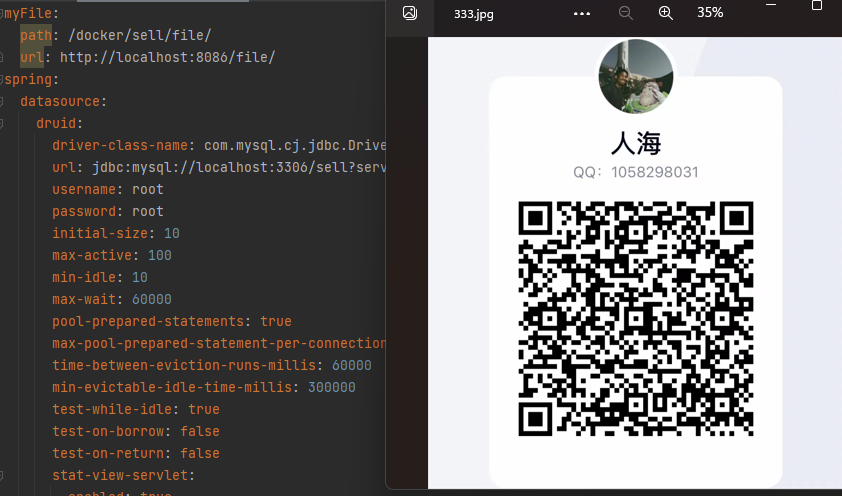

**系统一个共有三个端，分别是用户端、商家端和骑手端，麻烦各位同学们点点star！！** 

   项目的架构是SpringBoot和Vue的前后端分离，数据库为MySQL+Redis，MyBatis、Swagger接口文档、Shiro安全框架，3个客户端分别对应3个角色具有不同操作权限，

使用了主流的 **七牛云图片文件服务器** /本地存储两种文件上传访问方式，前后端采用Restful接口风格对接，采用Websocket通讯实时交互。
   
 :hand: 用户端和骑手端采用移动端UI框架Vant、商家端使用ElementUI

项目部署上采用Doker虚拟化技术部署在自己的阿里云上，整合合Nginx、Haproxy和keepalived,从数据库到后端、前端均采用多节点负载均衡策略部署。

整个项目用的都是目前主流的技术，覆盖前后端各个技术的基础，从数据库，到后端，再到前端，再部署上云，覆盖了前后端开发部署的全部流程及各种细节。

### 项目演示：
 :smile:  :smile:  :smile:  :smile:  :smile:  :smile:            

 :raised_hand:[移动用户端](http://43.139.228.129:8018/#/user)（电脑端打开请按F12进入开发模式,调成手机大小）

 :raised_hand:[商家PC端](http://43.139.228.129:8017/#/login)

 :raised_hand:[后端接口文档](http://43.139.228.129:8086/doc.html) 

**移动用户端主要界面：**    

### 项目说明：
本项目后端代码已全部开源，后端开发者可直接拉取下载代码，
如有疑问可沟通交流！

**移动骑手端主要界面：**    

**pc商家管理端主要界面：**    

